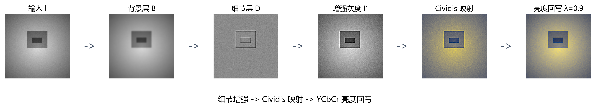
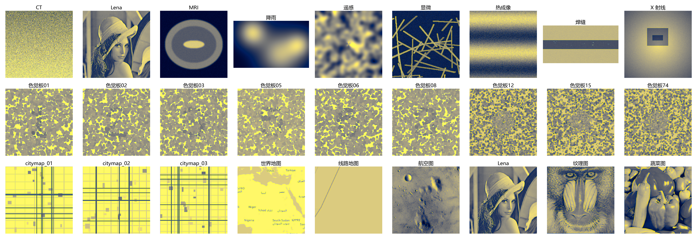
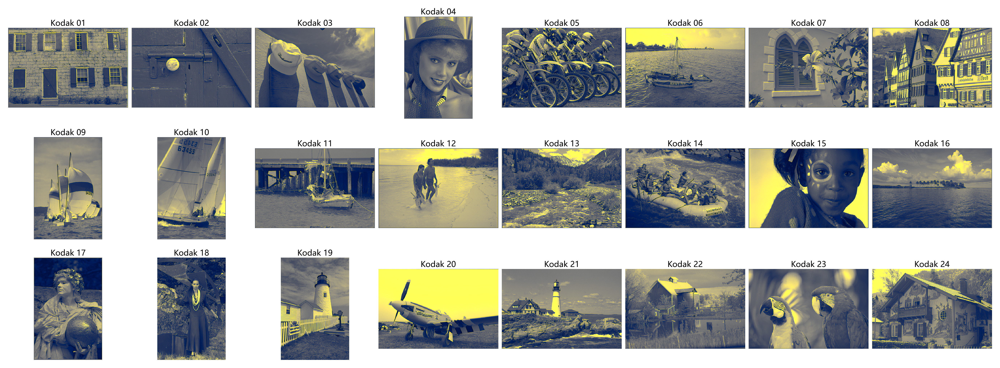
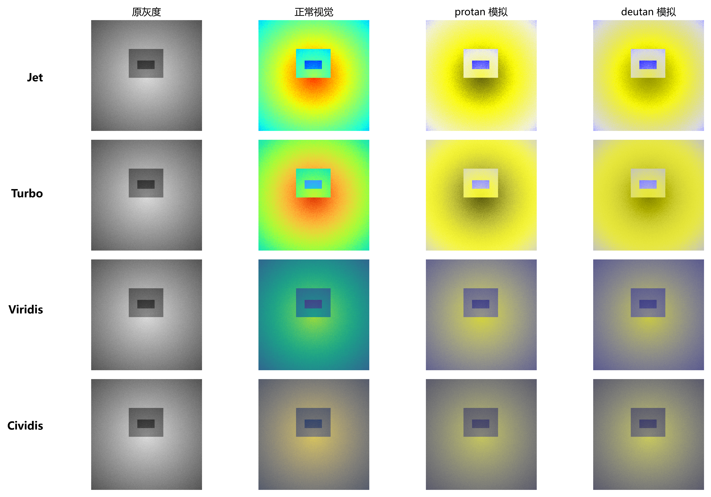

<div align="center">

# DE-Cividis

**Detail-enhanced pseudocolour mapping for simulated red-green colour-vision deficiency.**

`Python` · `NumPy` · `OpenCV` · `scikit-image` · `SciPy`

</div>

<p align="center">
  
</p>

DE-Cividis extends the perceptually uniform Cividis colormap with local-detail enhancement and luminance write-back. The goal is to preserve fine image structure after pseudocolour mapping while retaining the robust colour behaviour that makes Cividis suitable for red-green colour-vision deficiency.

## Results

The evaluation covers 27 primary images and a 24-image Kodak supplement.

| Dataset | Method | Y-SSIM ↑ | CIEDE2000 ↓ |
| --- | --- | ---: | ---: |
| Primary (27) | **DE-Cividis** | **0.982** | 15.21 |
| Primary (27) | Cividis | 0.948 | **14.85** |
| Primary (27) | Viridis | 0.914 | 24.79 |
| Primary (27) | Hot | 0.951 | 28.07 |
| Primary (27) | Jet | 0.214 | 39.54 |
| Kodak (24) | **DE-Cividis** | **0.992** | 12.36 |
| Kodak (24) | Cividis | 0.956 | **11.46** |

DE-Cividis produces the strongest luminance-structure similarity in both datasets while remaining close to plain Cividis on colour difference.

<p align="center">
  
  
</p>

## Method

1. **Extract local detail** from the grayscale input with a Gaussian-based high-frequency filter.
2. **Apply Cividis mapping** to obtain a perceptually uniform colour representation.
3. **Write luminance back** with `luminance_mix = 0.9`, preserving the original tone while carrying local structure into the colour output.

Eight methods are compared: intensity slicing, three-phase sinusoid, Jet, Hot, Turbo, Viridis, Cividis and DE-Cividis. The repository also includes parameter sensitivity and pipeline ablation experiments.

<p align="center">
  
</p>

## Evaluation design

- **Y-SSIM** measures structural similarity between output luminance and the source grayscale image.
- **CIEDE2000** measures colour difference between the mapped image and the grayscale reference.
- **CVD simulation** evaluates both deutan and protan views.
- **Ablation and sensitivity** isolate the contribution of enhancement, luminance write-back and parameter choices.

Y-SSIM directly rewards retained luminance structure, so the result should be read as image-structure preservation under simulation. A human-subject study with colour-vision-deficient readers would be the next validation step.

## Reproduce

```bash
pip install -r requirements.txt
python code/download_data.py
python code/generate_synthetic_data.py
python code/run_final_experiments.py   # run after configuring the complete benchmark set
```

Committed per-image and summary results are available in:

```text
results/final_results.csv
results/final_results_summary.csv
```

<details>
<summary>Dataset and report-generation note</summary>

The download and synthetic-data scripts prepare the public and generated portions of the benchmark. The Kodak, CT, thermal and plate-image collections used in the full 51-image evaluation are not redistributed here. The committed CSV files and figures preserve the complete reported result. Paper export additionally uses the original course-paper source and LibreOffice.

</details>

## Repository structure

```text
code/       method, baselines, metrics and experiment runners
figs/       pipeline, comparison, ablation and benchmark figures
results/    committed per-image and summary measurements
tests/      method and figure-generation checks
```

## Project context

Individual course research project completed from May to June 2026.

## License

Released under the [MIT License](LICENSE).
